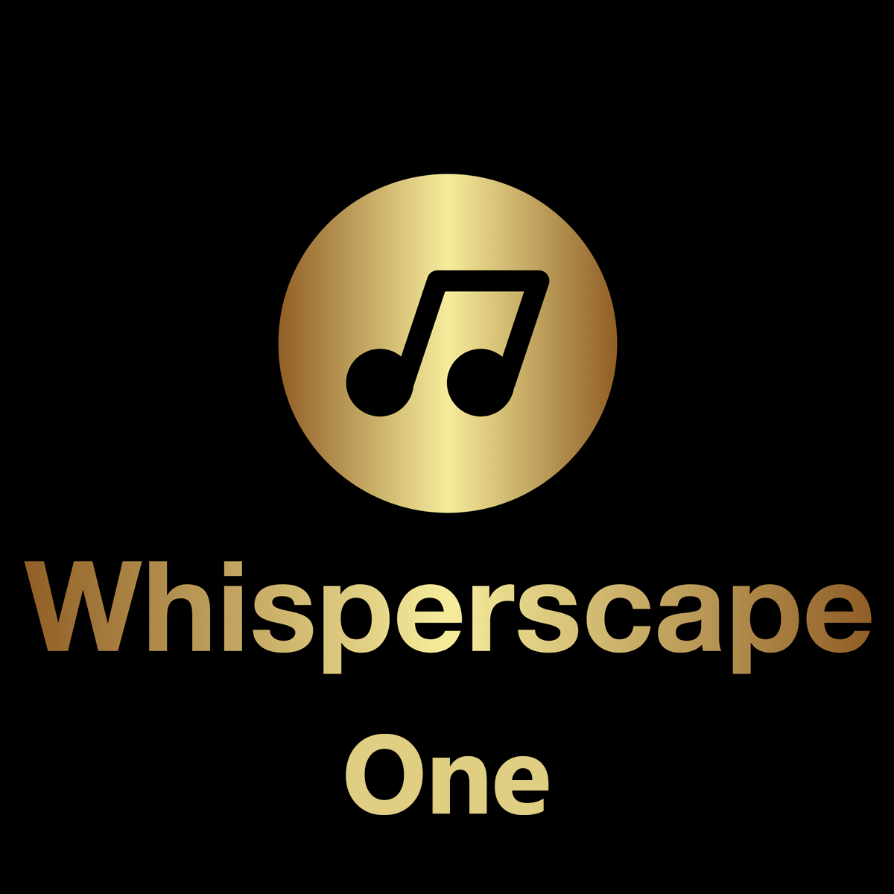
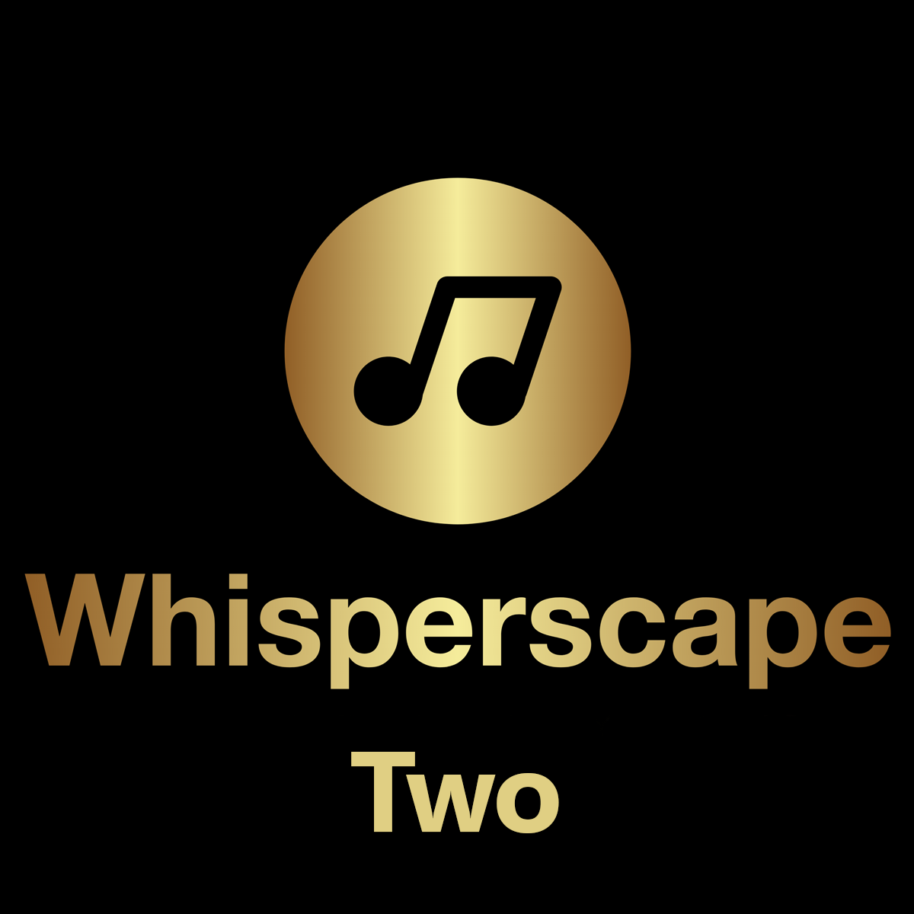

## What to hear it for yourself?

As an example, this is what eJukebox sounds like in real life. Go on, hook it up to some decent speakers/headphones, give it the pub test!

Listen on iHeart Radio

</a>

### Whisperscape One

<!--Simplest syntax-->
<audio src="https://listen.ejukebox.net/one" type="audio/mpeg" controls>
  I'm sorry. You're browser doesn't support HTML5 <code>audio</code>.
</audio>

Trouble with the embedded player? Take **Whisperscape One** wherever you go. Listen anywhere/anytime with the free iHeartRadio app, you can listen to **Whisperscape One** on [iHeart Radio](https://www.iheart.com/live/ejukebox-9243).

### Whisperscape Two

<!--Simplest syntax-->
<audio src="https://listen.ejukebox.net/two" type="audio/mpeg" controls>
  I'm sorry. You're browser doesn't support HTML5 <code>audio</code>.
</audio>

Trouble with the embedded player? Take **Whisperscape Two** wherever you go. Listen anywhere/anytime with the free iHeartRadio app, you can listen to **Whisperscape Two** on [iHeart Radio](https://www.iheart.com/live/ejukebox-smooth-9750).

#### Direct Links

Still having trouble, or if you manually want to add this to a custom app or Sonos for example? Here's a direct link to the stream: 
- [Listen Live Whisperscape One](http://listen.ejukebox.net/one)
- [Listen Live Whisperscape Two](http://listen.ejukebox.net/two)

